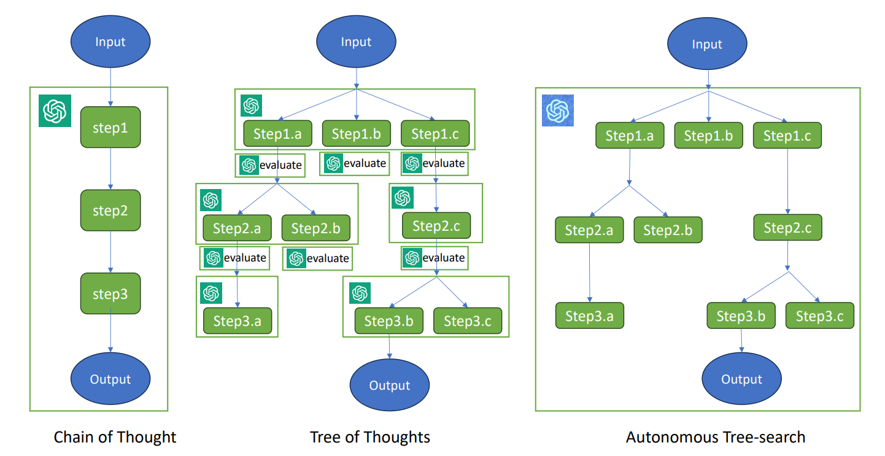

# Autonomous Tree-search Ability of Large Language Models

TL;DR: Large Language Models autonomously do tree-search to solve puzzles without the aid of external programs.



## GPT Experiment

```
.
├── run.py               # the main file of our experiment
├── tasks                # the folder containing four tasks
│   ├── DropWater        # Drop Water Puzzle
│   │   ├── data
│   │   └── task.py
│   ├── NumPath          # Number Path Puzzle
│   │   ├── data
│   │   └── task.py
│   ├── NumSplit         # Minimal Grass Puzzle
│   │   ├── data
│   │   └── task.py
│   └── threetoN         # Arithmetic Puzzle
│       ├── data
│       └── task.py
└── utils.py             # utils
```

The experiment instructions. [here](GPT_Experiment/experiment.md)

## LLaMA Experiment

```
.
├── generate.py          # generate
└── main.py              # fine tune
```

The experiment instructions. [here](LLaMA_Experiment/experiment.md)
